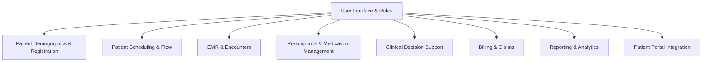

# High-Level Design Document: Multi-Tenant EHR System

## 1. Overview
This document outlines the high-level design for a modern Electronic Health Record (EHR) system, built to address healthcare IT needs with a focus on scalability, security, and compliance. The system is designed as a microservices architecture, segregating clinical data capture, diagnosis, prescription, and billing components. It integrates generative AI for note summarization, supports offline capabilities, uses FHIR APIs for clinical data, enforces multi-tenancy, provides a dedicated auditing service, and includes a data warehouse for ad-hoc reporting.

### 1.1 Objectives
- **Modularity**: Segregate clinical (data capture, diagnosis, prescription) and billing services using microservices.
- **AI Integration**: Use a generative AI model via a lightweight LLM proxy (e.g., LiteLLM) for clinical note summarization.
- **Offline Support**: Enable seamless UI experiences on laptops and mobile devices, even offline.
- **Standards Compliance**: Use FHIR API for clinical data get/set operations.
- **Multi-Tenancy**: Ensure strict security and data isolation between tenants (e.g., hospitals, clinics).
- **Auditing**: Provide a dedicated audit service with fast writes, cheap storage, and ONC-compliant reporting.
- **Analytics**: Include a data warehouse for ad-hoc reporting via GraphQL or FHIR APIs.

### 1.2 Scope
- **In Scope**: Clinical data management, billing, AI-driven note summarization, offline UI, FHIR integration, multi-tenancy, auditing, data warehouse.
- **Out of Scope**: Hardware specifications, third-party vendor integrations (e.g., specific imaging systems), patient-facing mobile apps.

## System Overview Diagram

This diagram illustrates the core modules and their relationships in the EHR proof of concept. Each module is further documented in the `/doc` directory:

- [User Interface & Roles](User_Interface_and_Roles.md)
- [Patient Demographics & Registration](Patient_Demographics_and_Registration.md)
- [Patient Scheduling & Flow](Patient_Scheduling_and_Flow.md)
- [EMR & Encounters](EMR_and_Encounters.md)
- [Prescriptions & Medication Management](Prescriptions_and_Medication_Management.md)
- [Clinical Decision Support](Clinical_Decision_Support.md)
- [Billing & Claims](Billing_and_Claims.md)
- [Reporting & Analytics](Reporting_and_Analytics.md)
- [Patient Portal Integration](Patient_Portal_Integration.md)

---

(Expand this document with more diagrams and technical details as the project evolves.)

## 2. System Architecture

### 2.1 Microservices Architecture
The EHR system is built using a microservices architecture, deployed on a cloud platform (e.g., AWS, Azure) with Kubernetes for orchestration. Each microservice is independently deployable, scalable, and communicates via RESTful APIs or gRPC for performance-critical interactions.

#### Key Microservices
1. **Clinical Data Service**:
   - Manages patient records, clinical notes, diagnoses, and prescriptions.
   - Uses FHIR API (v4.0.1) for data get/set operations.
   - Stores data in a NoSQL database (e.g., MongoDB) optimized for JSON-like FHIR resources.
2. **Billing Service**:
   - Handles billing calculations based on location, provider credentials, and service rates.
   - Integrates with external payer systems via APIs (e.g., HL7 for claims).
   - Uses a relational database (e.g., PostgreSQL) for structured billing data.
3. **AI Note Summarization Service**:
   - Integrates with a generative AI model via LiteLLM proxy (e.g., connects to models like Llama or GPT-4).
   - Summarizes clinical notes into concise, actionable insights.
   - Caches results in Redis for performance.
4. **Audit Service**:
   - Logs all system activities (e.g., data access, modifications) for compliance.
   - Uses a write-optimized database (e.g., Apache Cassandra) for fast writes and cheap cloud storage (e.g., AWS S3 Glacier) for infrequent reads.
   - Provides a reporting API for ONC compliance (e.g., 21st Century Cures Act).
5. **Data Warehouse Service**:
   - Aggregates de-identified data for analytics and ad-hoc reporting.
   - Supports GraphQL and FHIR APIs for read-only access.
   - Uses a columnar database (e.g., Snowflake, BigQuery) for efficient querying.
6. **Identity and Access Management (IAM) Service**:
   - Manages multi-tenancy, user authentication, and authorization.
   - Uses OAuth 2.0 and OpenID Connect with a tenant-specific key store (e.g., Keycloak).
7. **API Gateway**:
   - Centralizes external API access, routing requests to appropriate microservices.
   - Implements rate limiting, authentication, and request validation.

### 2.2 Architecture Diagram